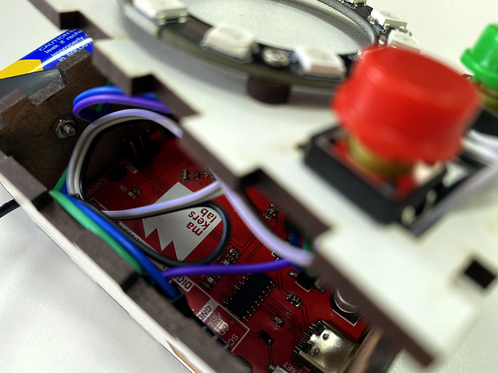
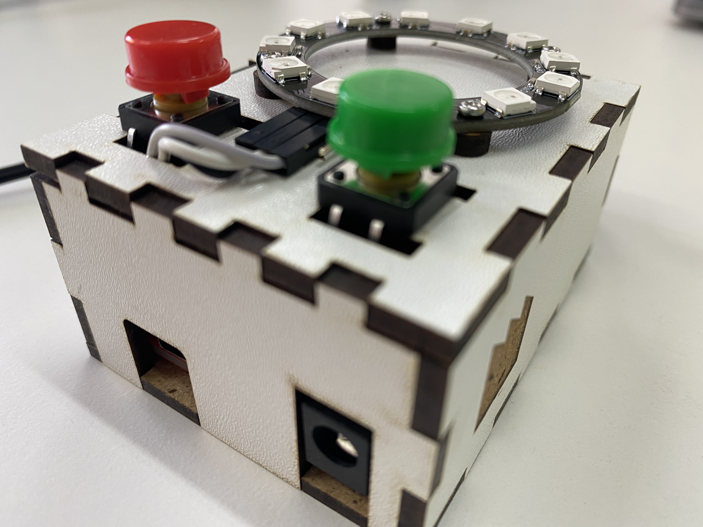
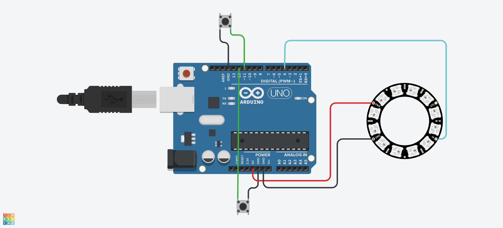
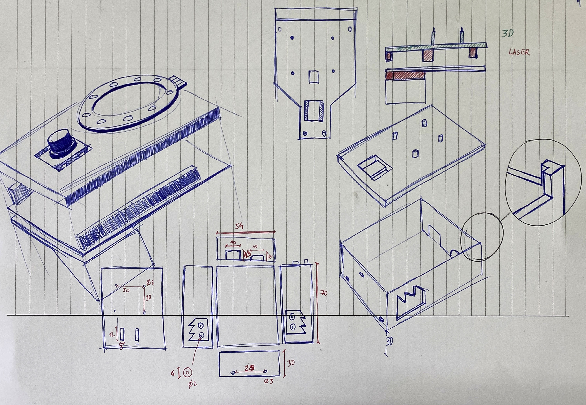

# Led-game

### What
A two players game based on a led Ring.
This game is based on this instructables project :: https://www.instructables.com/StopIt-LED-Game-powered-by-arduino/
 

 
 

### How 
the project is available in tinkerCAD at the following URL :: https://www.tinkercad.com/things/8sdC395uiPW
You will find a vector file in attached file for laser cutting. 
 

